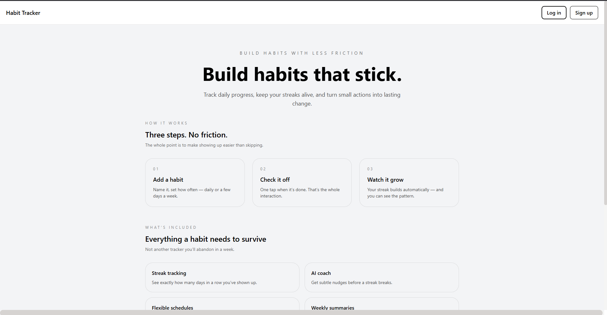
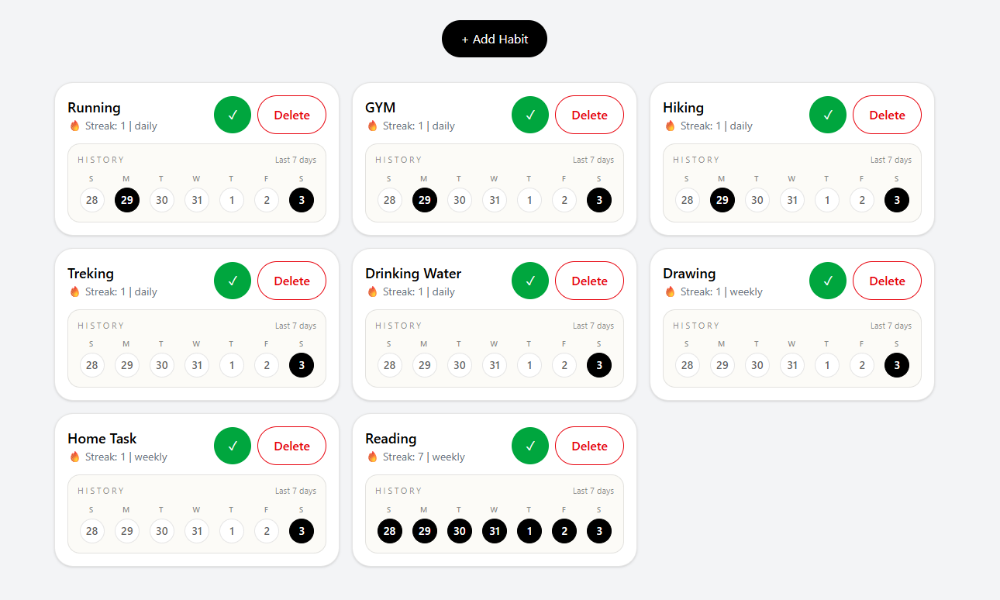
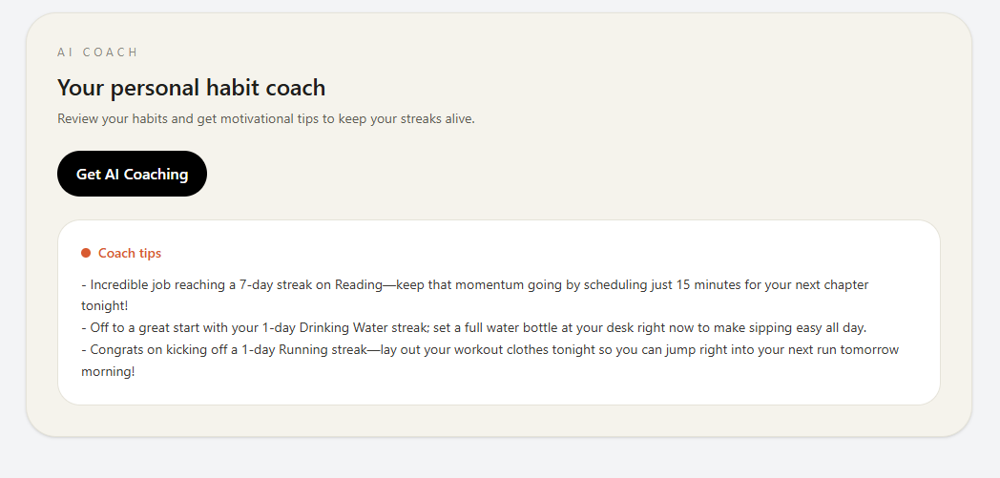

# Habit Flow

Habit Flow is a habit-tracking web app that helps users build consistency with a clean, motivating interface. Users can add habits, mark daily progress, backfill past days, view streaks, and get AI-powered coaching tips.

## What the app does

- Add new habits with custom frequency (daily or weekly)
- Mark habits as completed for today or backfill previous days
- Track streaks and visual history for the last 7 days
- Promote daily habits to weekly after a 7-day streak
- Get AI coaching suggestions based on current habit activity
- Sign in and manage habits securely with authentication

## Tech stack

- Frontend: React, Vite, React Router
- Backend: Node.js, Express, MongoDB, Mongoose
- AI: Google Gemini API
- Styling: Tailwind CSS

## How to run locally

### Frontend

```bash
cd frontend
npm install
npm run dev
```

### Backend

```bash
cd backend
npm install
npm run dev
```

Make sure you have your environment variables configured for the backend, including the Gemini API key.

## Features included

- Habit creation and deletion
- Daily/weekly habit tracking
- Past-day completion selection
- Streak tracking
- Mini calendar-style history view
- AI coach tips
- Clean responsive UI

## Screenshots

### Home page



### Streaks page


### AI Assistant page

## Live demo


